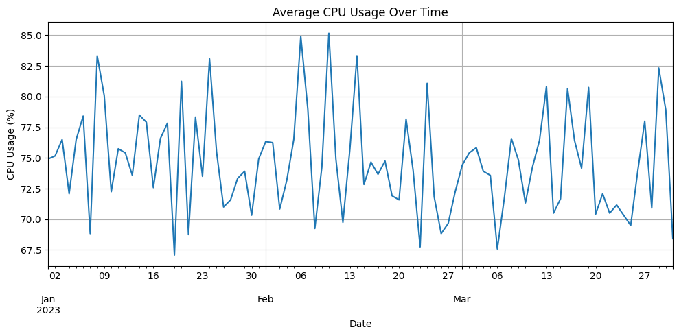
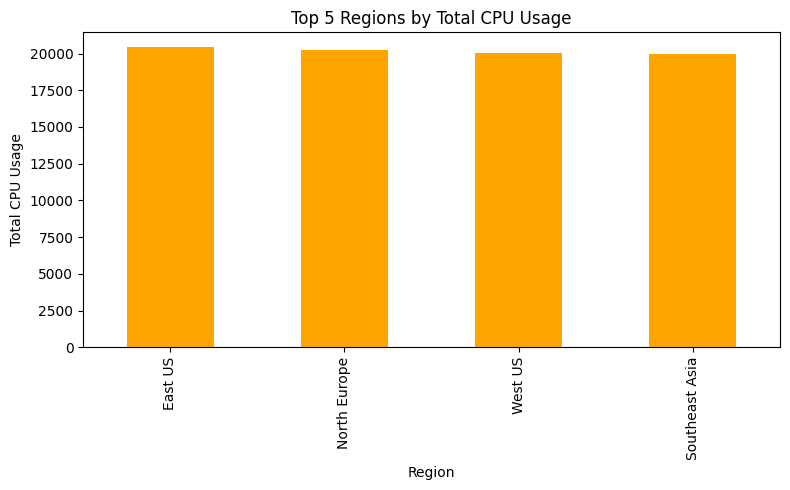

# Exploratory Data Analysis Report

## 1. Average Daily CPU Usage per Region

- **Average daily CPU usage per region:**
  ```
  region
  East US           75.640741
  North Europe      74.881481
  West US           74.207407
  Southeast Asia    73.877778
  Name: usage_cpu, dtype: float64
  ```

## 2. Top 5 Regions by Usage

- **Top 5 regions by total CPU usage:**
  ```
  region
  East US           20423
  North Europe      20218
  West US           20036
  Southeast Asia    19947
  Name: usage_cpu, dtype: int64
  ```

## 3. Peak Demand per Month

- **Peak CPU usage per month:**
  ```
  month
  2023-01    99
  2023-02    99
  2023-03    99
  Freq: M, Name: usage_cpu, dtype: int64
  ```

## 4. Visualizations

- 
- 

---

**Key Insights:**
- The East US region consistently shows the highest average and total CPU usage, indicating it is the most heavily utilized region.
- All regions have similar average daily CPU usage, with only minor differences between them.
- Peak CPU usage per month remains constant at 99, suggesting a possible usage cap or consistent maximum demand across months.
- No significant outliers are observed in the regional usage data, and usage patterns appear stable over the analyzed period.